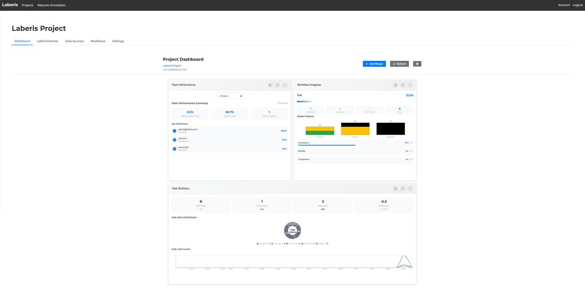
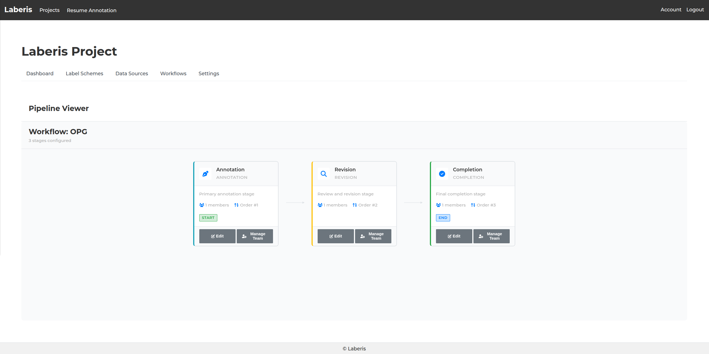
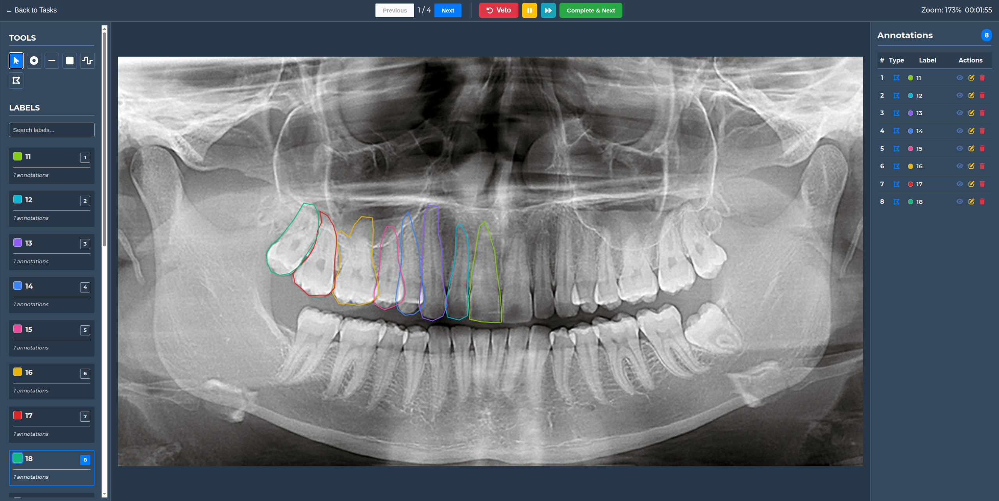

# Laberis - Data Annotation Platform

> A modern, collaborative data annotation platform built with .NET 9.0 and Vue.js, designed to streamline machine learning data preparation workflows.

[]()
[]()
[]()
[]()
[]()
[]()

---

## Table of Contents

- [Project Overview](#project-overview)
- [Key Features](#key-features)
- [Application Showcase](#application-showcase)
- [Getting Started](#getting-started)
- [Installation](#installation-options)
- [Configuration](#configuration)
- [Quality Assurance](#quality-assurance)
- [API Documentation](#api-documentation)
- [License](#license)
- [Support & Contact](#support--contact)

---

## Project Overview

**Laberis** is a web-based data annotation platform designed to facilitate collaborative machine learning data preparation. The platform emerged from practical experience with data annotation workflows in a professional environment, where the need for an efficient, cost-effective solution became apparent.

### What is Laberis?

Laberis focuses on making data annotation accessible and efficient for teams of all sizes. The platform combines modern web technologies with thoughtful UX design to create an environment where annotators, reviewers, and project managers can work together seamlessly.

**Core Concept**: Rather than treating annotation as a simple labeling task, Laberis models it as a collaborative workflow where data moves through defined stages - from initial annotation to quality review to final completion. Each stage can be customized with specific team assignments and quality control measures.

### Key Design Philosophy

- **Workflow-Centric**: Data annotation is modeled as a multi-stage process with clear responsibilities and quality gates
- **Team Collaboration**: Built-in role management (Viewer, Annotator, Reviewer, Manager) with granular permissions
- **Extensible Architecture**: Designed to support various data types beyond images, with a plugin-ready annotation system
- **Production-Ready**: Emphasis on reliability, performance, and enterprise features like audit trails and rate limiting

### Technology Stack

The platform leverages modern, production-tested technologies:
- **Backend**: .NET 9.0 with Entity Framework Core and PostgreSQL
- **Frontend**: Vue.js 3 with TypeScript and Pinia state management
- **Storage**: S3-compatible object storage (MinIO) for scalable data handling

### On-Premise First Design

**Laberis is built for organizations that need complete control over their data.** Unlike cloud-only annotation platforms, Laberis runs entirely within your infrastructure - perfect for:
- **Medical data** requiring HIPAA compliance
- **Financial data** with strict regulatory requirements  
- **Proprietary datasets** that cannot leave your network
- **Organizations** requiring full data sovereignty

Deploy with Docker Compose and maintain complete control over your annotation workflows and sensitive data.

---

## Key Features

### Project Management
- **Multi-tenant architecture** with isolated project workspaces
- **Team collaboration** with role-based permissions (Viewer, Annotator, Reviewer, Manager)
- **Progress tracking** with comprehensive dashboards and analytics
- **Quality metrics** monitoring annotation accuracy and team performance

### Workflow Engine
- **Customizable workflows** with 2-3 configurable stages:
  - **Annotation Stage**: Initial data labeling by designated team members
  - **Review Stage**: Quality control and validation by reviewers
  - **Completion Stage**: Final approval and export preparation by managers
- **Task management** with assignments, priorities, and due dates
- **Veto mechanism** enabling reviewers to return tasks for corrections
- **Progress tracking** across all workflow stages

### Annotation Tools
- **Multiple annotation types**: Points, Bounding Boxes, Polylines, Polygons
- **Canvas controls**: Zoom, pan, and precision drawing tools
- **Label management** with customizable label schemes per project
- **Time tracking** for performance analytics and workload planning
- **Keyboard shortcuts** for efficient annotation workflows

### Security & Access Control
- **JWT-based authentication** with automatic token refresh
- **Role-based authorization** at project and resource levels
- **Granular permission system** controlling feature access
- **API rate limiting** for abuse prevention
- **Audit trails** for tracking user actions and data changes

### Data Management
- **S3-compatible storage** for scalable data handling
- **Multiple data sources** per project with automatic organization
- **Asset management** with metadata and preview capabilities
- **Export capabilities** with COCO format support planned
- **Bulk operations** for efficient data processing

---

## Application Showcase

### Project Dashboard
Monitor team progress, track annotation quality, and manage project resources with comprehensive analytics and visualizations.



### Workflow Pipeline Management
Design and manage custom annotation workflows with stage assignments, team allocations, and progress tracking.



### Annotation Workspace
Professional annotation interface with advanced tools, zoom controls, label management, and precision drawing capabilities.



---

## Getting Started

### Prerequisites

- **Docker & Docker Compose** (recommended for quick setup)
- **Alternatively**: .NET 9.0 SDK, Node.js 18+, PostgreSQL 14+ for manual setup

### Quick Start with Docker (Recommended)

1. **Clone the repository**
   ```bash
   git clone https://github.com/yourusername/laberis.git
   cd laberis
   ```

2. **Start infrastructure services**
   ```bash
   docker compose -f docker-compose.dev.yaml up -d
   ```
   This starts PostgreSQL and MinIO containers for development.

3. **Configure environment variables**
   ```bash
   # Backend configuration
   cp server/.env.example server/.env
   # Frontend configuration  
   cp frontend/.env.example frontend/.env
   ```
   Review the example files - most defaults work out of the box for development.

4. **Setup and run backend**
   ```bash
   cd server
   dotnet restore
   dotnet run --project Server
   ```
   Database migrations and seed data run automatically on startup.

5. **Setup and run frontend**
   ```bash
   cd frontend
   npm install
   npm run dev
   ```

6. **Access the application**
   - **Frontend**: http://localhost:5173
   - **Backend API**: http://localhost:5000
   - **API Documentation**: http://localhost:5000/swagger

### Development Login

In development mode, you can enable automatic admin login by:
- Setting `VITE_USE_FAKE_USER=true` in `frontend/.env`
- Ensuring `"UseFakeUser": true` in `server/Server/appsettings.Development.json`

---

## Installation Options

### Docker Deployment (Production)

For production deployment, use the production compose file:

```bash
# Copy and configure environment files
cp .env.db.example .env.db.prod    # Infrastructure (Database, MinIO)
cp .env.example .env.prod          # Application (API, Auth, etc.)

# Edit both files with your production values
# IMPORTANT: Keep MinIO credentials synchronized between files

# Start all services
docker compose -f docker-compose.prod.yaml up -d

# View logs
docker compose -f docker-compose.prod.yaml logs -f

# Stop services
docker compose -f docker-compose.prod.yaml down
```

**Production Services:**
- **Frontend**: http://localhost:3000 (Nginx + Vue.js)
- **Backend API**: http://localhost:5000 (ASP.NET Core)
- **PostgreSQL**: localhost:5432
- **MinIO Console**: http://localhost:9001

**Security Notes:**
- Change all default passwords in `.env.prod`
- Use strong JWT secrets in production
- Consider using reverse proxy (nginx/caddy) for HTTPS
- Restrict database ports in production environments

### Manual Setup (Without Docker)

If you prefer to run databases locally or have existing infrastructure:

#### Backend Setup

1. **Install and configure PostgreSQL locally**
2. **Copy and configure environment**
   ```bash
   cd server
   cp .env.example .env
   # Edit database connection strings in .env
   ```
3. **Install dependencies and run**
   ```bash
   dotnet restore
   dotnet run --project Server
   ```

#### Frontend Setup

1. **Configure environment**
   ```bash
   cd frontend
   cp .env.example .env
   # Edit API endpoints if running backend on different port
   ```
2. **Install and run**
   ```bash
   npm install
   npm run dev        # Development
   npm run build      # Production build
   ```

---

## Configuration

Laberis uses environment variables for all configuration. Copy the example files and customize as needed.

### Backend Configuration (`server/.env`)

```bash
# Database Connection
ConnectionStrings__PostgresConnection=Host=localhost;Port=5432;Database=laberis;Username=laberis_user;Password=your_password

# Web Application
WebApp__ClientUrl=http://localhost:5173

# JWT Authentication
JWT__Secret=your-256-bit-secret-key-here
JWT__Expiration=60  # minutes
JWT__RefreshTokenExpiration=7  # days
JWT__ValidIssuer=Laberis
JWT__ValidAudience=Laberis

# Default Admin User (created on first startup)
DefaultAdminUser__Email=admin@laberis.local
DefaultAdminUser__Username=admin
DefaultAdminUser__Password=admin123

# SMTP Configuration (optional - for user invitations)
SMTP__Host=smtp.gmail.com
SMTP__Port=587
SMTP__Username=your-email@gmail.com
SMTP__Password=your-app-password
SMTP__FromName=Laberis
SMTP__FromAddress=no-reply@laberis.io
```

### Frontend Configuration (`frontend/.env`)

```bash
# API Connection
VITE_API_BASE_URL=http://localhost:5000/api

# Application Settings
VITE_APP_NAME=Laberis
VITE_APP_VERSION=0.1.0

# Development Features
VITE_AUTO_LOGIN_DEV=true  # Auto-login as admin in dev mode

# Logging Configuration
VITE_LOG_LEVEL=debug
VITE_LOG_IN_PRODUCTION=false
VITE_LOG_TIMESTAMPS=true
VITE_LOG_SERVICE_PREFIX=true
```

### Docker Services Configuration (`.env.db`)

For the Docker Compose infrastructure services:

```bash
# PostgreSQL Database
POSTGRES_USER=laberis_user
POSTGRES_PASSWORD=laberis_pass
POSTGRES_DB=laberis

# MinIO Object Storage
MINIO_ROOT_USER=laberis_minio
MINIO_ROOT_PASSWORD=laberis_minio_pass
```

### Configuration Notes

- **Required**: Database connection and JWT secret are mandatory
- **SMTP**: Only needed if you plan to invite users via email
- **Auto-login**: Set `VITE_AUTO_LOGIN_DEV=true` for development convenience
- **Production**: Use strong passwords and proper secrets in production
- **MinIO**: Credentials must match between backend config and Docker environment

---

## Quality Assurance

Laberis maintains high code quality with comprehensive testing and automated CI/CD processes.

### Test Coverage

- **400+ automated tests** across backend and frontend
- **Backend**: Unit and integration tests using xUnit
- **Frontend**: Component and utility tests using Vitest
- **API**: Full endpoint testing with various scenarios
- **Database**: Repository pattern testing with in-memory providers

### Continuous Integration

- **Automated CI/CD pipeline** runs on every pull request
- **Code quality checks** including linting, type checking, and formatting
- **Test execution** across all test suites
- **Build verification** for both development and production configurations

### Code Quality Standards

- **TypeScript** for type safety and enhanced developer experience
- **ESLint** and **Prettier** for consistent code formatting
- **EditorConfig** for cross-editor consistency
- **Entity Framework** migrations for reliable database schema management

---

## API Documentation

### Interactive Documentation

When running in development mode, visit `/swagger` for comprehensive, interactive API documentation with:
- **Complete endpoint reference** with request/response schemas
- **Try-it-out functionality** for testing endpoints directly
- **Authentication integration** for testing secured endpoints
- **Model definitions** for all DTOs and data structures

### Comprehensive API Coverage

The API provides full REST endpoints for:
- **Authentication & Authorization** - User login, registration, JWT token management
- **Project Management** - CRUD operations, member management, dashboard analytics
- **Workflow Engine** - Stage configuration, task assignment, progress tracking
- **Data Sources** - S3 bucket integration, asset management, metadata handling
- **Annotation Tools** - Annotation CRUD, label schemes, export functionality
- **User Management** - Roles, permissions, team collaboration features

*Dedicated documentation site is planned for future release.*

---

## License

This project is licensed under the [GNU General Public License v3.0](LICENSE).

### Why GPLv3?

Laberis uses GPLv3 to ensure that improvements to the codebase benefit the entire community. This copyleft license:

- **Protects user freedom**: Organizations can use, modify, and deploy Laberis freely
- **Ensures contributions remain open**: Any modifications must be shared back to the community  
- **Prevents proprietary lock-in**: No one can create closed-source versions that restrict user rights
- **Supports sustainable development**: Commercial users who want proprietary modifications can contribute back or seek alternative arrangements

This aligns with our mission to provide accessible, community-driven data annotation tools that remain free and open for everyone.

---

## Support & Contact

### Issues & Bug Reports
Please use the [GitHub Issues](https://github.com/yourusername/laberis/issues) page to report bugs or request features.

### Project Status
Laberis is actively developed and approaching v1.0 release. Contributions and feedback are welcome as the project stabilizes.

---

<div align="center">
  <strong>⭐ If you find this project useful, please consider giving it a star! ⭐</strong>
</div>